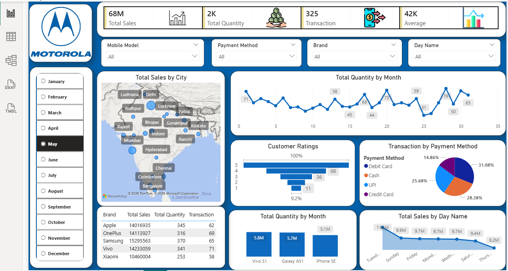

# Mobile Sales & Customer Analysis Dashboard (Power BI)

This project is a Power BI dashboard created to analyze mobile sales data, customer behavior, and transaction trends across different cities and brands.

## Dataset
The dataset contains transactional data of mobile sales, including:

- Mobile Brands (Apple, Samsung, Vivo, Xiaomi, etc.)
- Units Sold and Price Per Unit
- Customer Name, Age, and Ratings
- City-wise sales information
- Payment Methods (UPI, Credit Card, Debit Card, Cash)
- Date details (Day, Month, Year)

Dataset Link:  
https://github.com/Pratheekrs/PowerBI-Mobile-Sales-Analysis/blob/main/Mobile%20Sales%20Dataset.xlsx

##  Dashboard Preview

## 📊 Key KPIs
- Total Sales: 68M
- Total Quantity: 2K
- Total Transactions: 331
- Average Sales: 41K

---

##  Insights
- Apple and OnePlus generated the highest revenue
- Most transactions were made using Credit Card and UPI
- Sales were higher in major cities like Delhi and Mumbai
- Peak sales observed during mid-month period
- Weekends showed slightly lower sales compared to weekdays

---

## 🛠 Tools Used
- Power BI
- DAX (Data Analysis Expressions)
- Data Cleaning (Power Query: Add Column, Custom Column)

---

## 🚀 Features
- Interactive filters (Month, Brand, Payment Method)
- Sales analysis by City and Day
- Customer rating insights
- Payment method distribution
- Brand-wise performance comparison

---

## 📌 Conclusion
This dashboard helps in understanding sales patterns, customer preferences, and business performance. It provides actionable insights that can support better decision-making and strategy planning.
